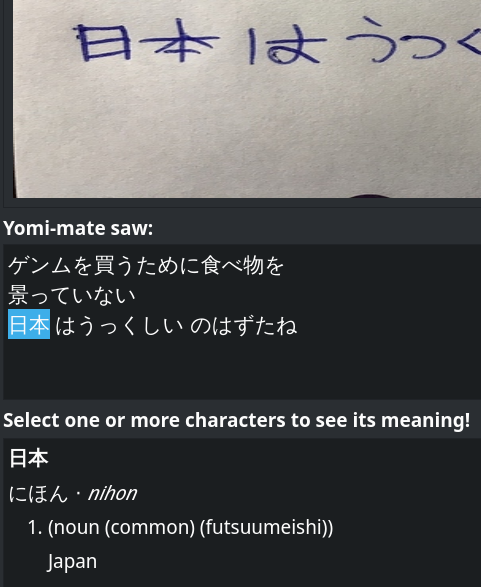
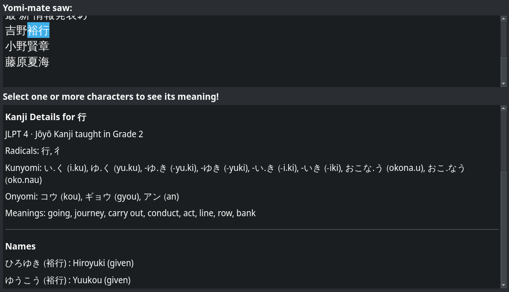

# Yomi-mate
**読み**

よみ ⋅ yomi

(noun)

1. reading
2. reading (of a kanji, esp. kun reading)​

**Mate**

*/meɪt/*

1.  (colloquial, Britain, Australia, New Zealand, sometimes elsewhere in the Commonwealth) A friend

---

An Optical Character Recognition driven dictionary. Inpired by the pop-up dictionary browser extension Yomichan (https://github.com/FooSoft/yomichan)

Created as an entry for the UQ Computing Society Hackathon 2022

---

## How It Works
Choose an image for Yomi-mate to scan through and it'll show you any Japanese text it detects. Then, you can highlight a particular word or character and it'll show you a dictionary entry for it.


## Features
### Word Definitions

### Kanji Breakdown
Shows you details like the JLPT grade (if any), radicals, readings, as well as its meanings.
It also checks if the selection contains a name, and shows its variations.


---

## Requirements
Linux / MacOS (untested): Python 3.10 or later\
Windows: Untested

## Setup
In the project's root folder:
```bash
# Create and activate virtual environment
python -m venv env
source env/bin/activate

# Install requirements
pip install -r requirements.txt
```

Then, to run the application:
```bash
# Activate virtual environment
source env/bin/activate
python ./frontend.py
```
---
## Project Limitations
1. Long & unfriendly installation process
1. Untested on Windows
1. Inaccurate readings
1. Unreliable GPU support
1. UI could be nicer

Frankly, this project is a bit of a mess. It's built on spaghetti hackathon code and is a hassle to get working for most users. I plan on reworking the entire thing to deal with these issues ~some~ time in the future.

---
# Acknowledgements
## Inspirations
[Yomichan](https://github.com/FooSoft/yomichan)

## Tools used
[EasyOCR](https://github.com/JaidedAI/EasyOCR) (Optical Character Recognition)

[JamDict](https://github.com/neocl/jamdict) (JMDict Parsing & Querying)

[Pykakasi](https://github.com/miurahr/pykakasi) (Kana/Hiragana/Kanji to Romaji conversion)


